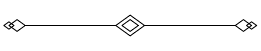
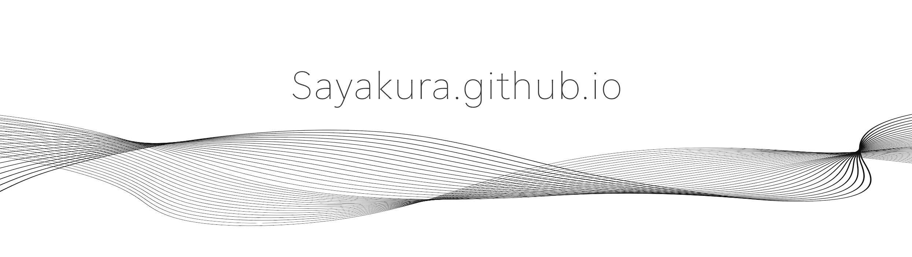

  <samp>
    <a href="http://sayakura.github.io/">Portfolio</a> .
    <a href="https://leetcode.com/midokura/">Leetcode</a> .
    <a href="https://www.linkedin.com/in/kurapeng/">Linkedin</a>
  </samp>

<h3 align="center">
  <samp>
    Hello I am Kura!  
    A Software Engineer 🤖️ from the Bay Area
  </samp>
</h3>
<samp>

  

- **Life** ⭐: Learning & Job hunting

- **Current Project** 📘: [Algorithm](https://github.com/sayakura/AlgoCollection) 

- **Leetcode # of Problem Solved** ✅ : Total of **568**     Easy **178**/480 Medium **320**/968 Hard **70**/387
  

  
<samp>Articles</samp>

  
- [Leetcode Contest 237](https://sayakura.github.io/posts/lcwc237/)
 

 
---
<!--

-->

<a href="https://sayakura.github.io">
  
  <!-- 
  github-readme-stats.vercel.app/api/wakatime?username=sayakura&theme=buefy -->
</a>

